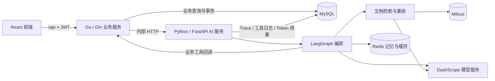

# DevAssist 开发者智能技术支持平台

面向 API 开放平台的开发者技术支持系统。将文档问答、调用诊断、账单解释与工单处理放到同一条会话链路中，帮助开发者定位问题，并让技术支持在接管时获得已有上下文。

项目采用 **Go 业务后端 + Python AI 服务 + React 前端**。Go 管理用户、业务数据和事务，Python 负责模型调用、Agent 编排与检索增强问答。当前使用本地知识文档和种子数据演示业务，不接入真实 API 平台的日志、计费或退款系统。

## 需求分析

### 使用者与问题

API 平台的开发者在接入时需要查签名规则、错误码和回调说明；调用失败时，需要将错误与具体请求、Key 状态、套餐限制关联起来。技术支持则需要保留诊断过程，减少转人工后的重复追问。

| 使用者 | 主要需求 | 项目提供的入口 |
| --- | --- | --- |
| 客户开发者 / 客户管理员 | 查文档、排查报错、理解费用、追踪处理进度 | 智能助手、会话记录、我的工单、文档 |
| 技术支持 | 查看诊断上下文、接管会话、回复与处理工单 | 工作台、诊断卡片、执行链路 |
| 平台管理员 | 查看会话与意图分布、Token 成本和评估结果 | 运营指标 |

### 核心业务闭环

1. 用户登录并提出问题，系统根据身份确定租户和可访问的数据。
2. AI 判断问题类型；缺少定位信息或意图置信度不足时先追问。
3. 按需检索文档、查询调用日志与 Key 状态，或查询套餐、用量和账单。
4. 汇总结论、证据和处理步骤，对生成回复及诊断卡片脱敏。
5. 需要人工处理时创建工单，或由用户反馈触发转人工；技术支持接管并回复。
6. 保存会话与 AI 执行记录，供后续查询和排查。

可演示的问题包括：`签名算法怎么生成？`、`request_id 为 req_xxx 的请求为什么返回 401？`、`大量 429 应该怎么处理？`、`这个月账单为什么上涨？`。涉及业务数据的示例需使用种子数据中实际存在的请求和账号。

## 架构设计



### 服务职责

| 模块 | 负责什么 | 关键入口 |
| --- | --- | --- |
| Go 业务服务 | JWT / bcrypt、租户与角色检查、会话/消息/反馈、工单、工作台、文档、统计、业务工具和 SSE | `backend-go/cmd/server/main.go`、`backend-go/internal/api/` |
| Python AI 服务 | 意图识别、专业 Agent、RAG、模型调用、记忆/缓存、脱敏、AI 执行记录 | `ai-py/app/ai_main.py`、`ai-py/app/agents/supervisor.py` |
| React 前端 | 客户会话、文档、工单、支持工作台、链路展示和运营指标 | `frontend/src/` |
| MySQL | 业务记录，以及 AI Trace、工具日志和 Token 用量；两种服务按职责写入 | `ai-py/app/models.py`、`backend-go/internal/model/models.go` |
| Redis | 会话历史、实体记忆、意图路由缓存、语义答案缓存 | `ai-py/app/memory/`、`ai-py/app/cache/` |
| Milvus | 知识切片及向量索引；etcd 与 MinIO 提供其基础依赖 | `ai-py/app/rag/` |

将业务与 AI 拆开后，Go 可以直接执行权限检查和业务事务；Python 保留模型 SDK、LangGraph 和检索组件。代价是增加内部 HTTP 调用、两个进程的运行管理，以及跨服务失败处理。

### 一次聊天请求如何执行

Go 校验 JWT 后根据用户 ID 重新查询用户，确定角色、租户与会话权限，先保存用户消息，再调用 Python 内部 AI 接口。AI 读取记忆、识别意图，并按路由执行专业 Agent：诊断与账单任务可以并行；它们内部也可以检索文档，纯文档问题单独走文档 Agent。

业务工具通过内部 HTTP 回调 Go，由 Go 查询或写入 MySQL。Python 汇总结果并返回完整答案，Go 用短事务保存助手消息和会话状态，再发送 SSE 字符块。AI 等待期间不占用覆盖整个请求的业务数据库事务。

两个内部方向都验证 `INTERNAL_SERVICE_TOKEN`。工具上下文中的用户、租户和内部角色来自可信请求，模型参数不能覆盖这些身份字段。普通生成链路经过安全审查；澄清与缓存命中有单独分支，因此不能把流程描述为所有请求都执行全部节点。

### 文档检索

Markdown 文档切片后，通过 Embedding 写入 Milvus。在线查询结合向量检索与 BM25，使用 RRF 合并候选，再经过 Rerank 和上下文压缩生成带引用的答案；错误码支持标量过滤。文档更新后需要重新入库，并重启 AI 服务以刷新进程内 BM25 缓存。

## 最简单启动方式

### 已配置好依赖和数据

在项目根目录检查基础设施：

```bash
make infra-status
```

如果基础设施未运行，执行 `make infra-up`，等待所有服务健康。然后分别在三个终端运行：

```bash
make run-ai    # 终端 1：Python AI，127.0.0.1:8000
make run       # 终端 2：Go API，127.0.0.1:8080
make front     # 终端 3：React，localhost:5173
```

打开 **http://localhost:5173**。`make health` 检查 Go API，`curl http://127.0.0.1:8000/health` 检查 AI 服务；健康接口返回成功不等于模型、检索和所有依赖都可用。

Makefile 默认使用 `ai-py/.venv/bin/python`，无需先激活虚拟环境。使用其他 Python 环境时，可传入 `make PYTHON=/绝对路径/python run-ai`。已有环境不要再次运行 `make setup`。

### 首次安装

准备 Docker + Compose v2、Go 1.26+、Python 3.11（项目要求 >=3.11）、Node.js 18+，以及有可用额度的 DashScope API Key。

在项目根目录执行：

```bash
python3 -m venv ai-py/.venv
ai-py/.venv/bin/python -m pip install -e './backend[dev]'
test -f ai-py/.env || cp ai-py/.env.example ai-py/.env
npm --prefix frontend ci
```

编辑 `ai-py/.env`：

| 配置 | 用途 |
| --- | --- |
| `DASHSCOPE_API_KEY` | LLM、Embedding 和 Rerank 调用 |
| `INTERNAL_SERVICE_TOKEN` | Go 与 Python 共用，至少 32 字符 |
| `JWT_SECRET` | 登录 Token 签名，替换示例默认值 |
| `MYSQL_*`、`REDIS_URL`、`MILVUS_URI` | 与本地 Compose 的地址和端口一致 |
| `BUSINESS_TOOLS_BACKEND=go` | AI 服务通过 Go 执行业务工具 |

可用以下命令生成随机凭证，再手动填入配置；已有配置不要覆盖：

```bash
ai-py/.venv/bin/python -c 'import secrets; print(secrets.token_urlsafe(48))'
```

Go 默认补充读取 `ai-py/.env` 的共享配置；需要覆盖 Go 专属连接或监听配置时，使用环境变量或 `backend-go/.env`，示例见 `backend-go/.env.example`。

启动基础设施并等待全部健康：

```bash
make infra-up
make infra-status
```

**仅全新、无待保留数据的环境**运行：

```bash
make setup    # 删表重建、写入种子数据、知识向量入库
```

`make setup` 包含破坏性重建；知识入库会调用付费 Embedding。数据准备完成后，使用上面的三个启动命令。Compose 仅管理基础设施，Go、Python 和前端仍需分别启动。

### 演示账号与端口

种子账号密码统一为 `password123`，仅用于本地演示：

| 账号 | 角色 |
| --- | --- |
| `dev_acme` / `admin_acme` | 客户开发者 / 客户管理员 |
| `support1` | 技术支持 |
| `admin` | 平台管理员 |

| 服务 | 本地端口 |
| --- | --- |
| React / Go API / Python AI | 5173 / 8080 / 8000 |
| MySQL / Redis / Milvus | 3307 / 6380 / 19531 |
| MinIO 控制台 | 9003 |

## 业务边界

- **支持范围**：API 接入文档、调用诊断、套餐/账单解释与工单协作。日志、Key、用量和账单来自项目数据库中的演示数据；未接入真实平台的采集、计费和支付链路。
- **高风险操作**：退款、套餐变更和 Key 重置在工具层拒绝自动执行，转人工处理；系统不会直接完成资金或账户变更。
- **知识与回答**：引用和检索结果提供核查线索，不保证模型的每个细节都正确。当前文档还缺少完整的独立鉴权签名、错误码和限流手册；真实样本也发现过无依据细节，需补充资料并单独评审。
- **输出方式**：当前 SSE 是完整答案保存后分块发送，并非模型实时 Token 流。
- **一致性与重试**：Go 的短事务保护对应业务写入，没有 Go/Python 跨服务原子事务、工具建单幂等或失败自动补偿。AI 失败时，已提交的用户消息可能保留；客户端重试也可能重复触发工具副作用。
- **人工处理依赖**：人工回复和会话补充也调用 Python 脱敏接口；AI 服务不可达时，这些写入会失败，不能绕过脱敏保存明文。
- **租户权限**：客户数据受租户限制；同租户会话和内部支持角色有各自访问规则，不能宣称所有会话仅创建者可见。
- **运行规模**：当前证据覆盖本地工程链路，未完成服务器部署、长期容量或生产 SLA 验收。默认账户、密码和基础设施端口面向开发环境。

## 项目结构

```text
backend-go/         Go 业务服务、权限与事务
ai-py/            Python AI、数据准备、评估及回归测试
frontend/           React 页面和前端测试
data/knowledge/    本地 Markdown 知识文档
docs/              服务拆分说明、源码阅读与验收记录
docker-compose.yml MySQL、Redis、Milvus 及依赖
Makefile           启动、检查和数据准备命令
```

`.env`、`.venv`、`node_modules` 和构建缓存不纳入版本管理。Python 旧业务入口 `app.main` 与 `legacy_sql` 保留用于接口对照和明确回退，常规启动使用 Go + `app.ai_main`；两套业务入口不能同时接收写请求。

## 验证与维护

```bash
make check    # Go vet/test/race/build、Python 测试、前端构建与 SSE 测试；零模型调用
make eval     # 真实模型评估，需要 Go 工具入口；付费
make bench    # 压测与阶段耗时检查，可能产生多次付费模型调用
```

2026-10-04 目录整理后的验证：Go 7 项测试及 race、Python 5 项、前端 4 项 SSE 测试与构建通过；隔离 MySQL 的 127 项检查通过，包含浏览器 10 项，模型调用为 0。Go 和完整链路在临时容器内验证，浏览器使用单进程无 GPU 配置。上述结果证明对应接线与业务行为，不代表真实模型质量或生产容量。

- [服务拆分设计](docs/GO_PYTHON_MINIMAL_MIGRATION_PLAN.md)
- [源码阅读与职责差异](docs/GO_PYTHON_LEARNING_DIFF.md)
- [验收记录与限制](docs/GO_PYTHON_MIGRATION_ACCEPTANCE.md)
- [隔离链路检查结果](docs/GO_PYTHON_MIGRATION_TEST_EVIDENCE.json)
- [真实模型样本及人工核查](docs/GO_PYTHON_REAL_AI_EVIDENCE.json)

部署时将 `/api` 反代到 Go，并关闭 SSE 响应缓冲；Python 与内部工具只走回环或私网，容器之间使用服务名。`make infra-down` 保留数据卷，`make clean` 会删除数据卷，已有环境不要将后者用于普通停止操作。
