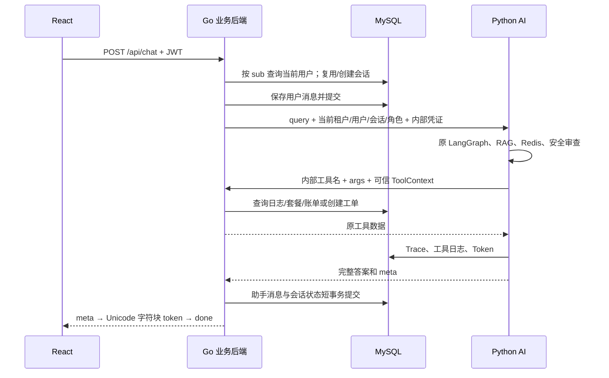

# 迁移后的源码学习差异

日期：2026-10-04。本文按当前 Go 业务服务与 Python AI 服务的职责说明源码阅读路径。

## 先理解请求全链路

聊天不是模型实时 token 流。Go 等完整结果生成并存储后再按 18 个 Unicode 字符发送，人工确认按 12 字符；中文和 emoji 不按 UTF-8 字节截断。

## 四条业务链路与源码入口

| 链路 | 核心源码 | 学习重点 |
| --- | --- | --- |
| 登录与权限 | `backend-go/internal/auth/auth.go`、`internal/api/server.go` | bcrypt 按 UTF-8 截断 72 字节；HS256；按 sub 重查当前用户，不信 JWT 旧角色 |
| 聊天与 AI | `internal/api/chat.go`、`internal/aiclient/client.go`、`ai-py/app/ai_main.py`、`app/agents/supervisor.py` | 用户消息先提交；AI 期间无数据库事务；双向内部凭证；请求取消与超时 |
| 工单与人工 | `internal/api/tickets.go`、`workbench.go`、`internal/service/tools.go` | 反馈/人工回复/审计短事务；map 更新 false、空字符串；ToolContext 与模型参数分离 |
| Trace 与统计 | `internal/api/observability.go`、Python 原 `observability/` | Python 单一写入 AI 记录，Go 只查询；Token 总量不等于精确人民币费用 |

八个普通业务工具的 SQL 位于 Go `internal/service/tools.go`。Python `app/tools/*.py` 保留原 ToolSpec/schema，薄适配走 `go_client.py`，原 registry 保留超时、重试和日志。高风险退款/重置 Key/变更套餐仍是阻断占位。

## 保留原行为的原因

表名全部显式映射，Go 不 AutoMigrate；JSON 自定义 Scanner/Valuer 保持 null、对象、数组、false、数字并防止二次编码。Python 的应用默认值在 Go 构造函数补齐。输出 UTC 无时区 ISO 时间，消息保留六位微秒。

原会话列表按租户及本人过滤，详情按租户过滤；内部角色跨租户。不借迁移重做权限。原日志窗口优先取最近 429 锚点，只限制下界；Key 过期和工单 ID 保留 2026-06-15 演示基准日。

脱敏正则含 Python 前后向断言，因此非 AI 消息和人工回复调用内部纯函数。不绕过清洗；Python 不可达时这些写入返回失败。

## 故障边界

Go 没有新增重试、去重、跨服务事务或恢复任务。用户消息已提交后，AI/落库可能失败；Python 可能已经创建工单。HTTP 超时只表示 Go 停止等待，不保证 Python 与模型停止执行。Python 原工具重试可能重复建单。SSE 已开始后断连不追加 JSON，不伪造 done；前端把没有 done 的 EOF 视为中断。

## 三分钟口述

“我的项目采用 Go 实现业务后端，Python 保留 LangGraph、RAG 和原记忆缓存。Go 根据 JWT sub 重查用户，把业务数据存在原 MySQL；保存用户消息后调用内部 AI，Python 工具再回调 Go 查询日志、账单或建单。AI 返回完整答案后，Go 用短事务保存回复和会话状态，再发送 SSE 字符块。这样 Go 真正承担鉴权、SQL 和事务，Python 保留已有 AI 生态。两边按业务表和 AI 记录分写入职责，内部凭证与可信 ToolContext 防止模型覆盖身份。它没有跨服务原子性、工具建单幂等或真实 token 流，真实模型质量和服务器部署要分别验收。”

理解项目时应能够定位关键源码，演示正常请求与失败场景，并准确说明实现边界。
